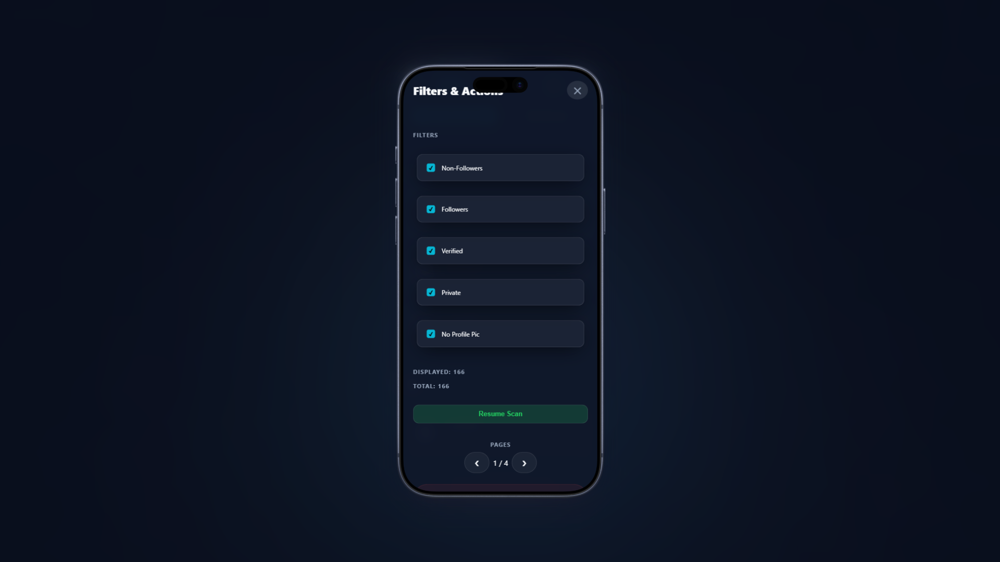
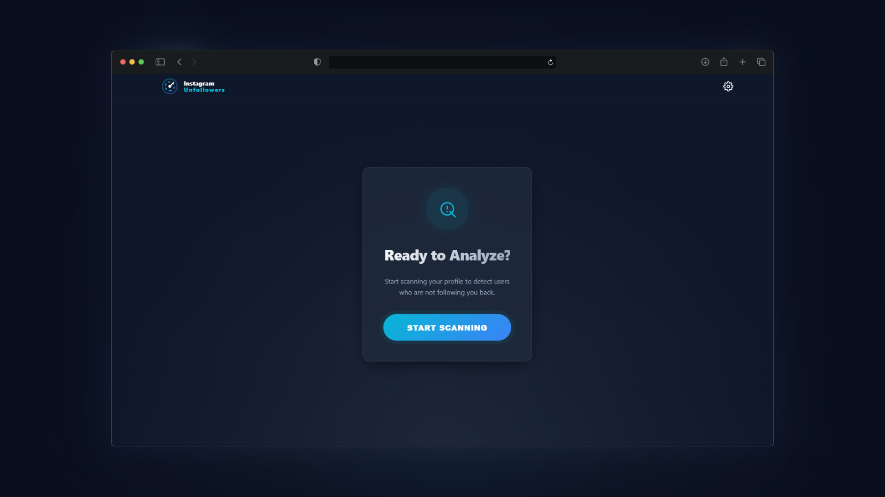

# 👁️ Instagram Unfollowers 2025 - Safe & Modern Script

[](https://github.com/edvincodes/InstagramUnfollowers)
[](LICENSE)
[](https://preactjs.com/)
[](https://www.instagram.com/)

[🇺🇸 English](#-english-version) | [🇪🇸 Español](#-versión-en-español)

---

<div id="english"></div>

## 🇺🇸 English Version

**The safest, open-source tool to see who unfollowed you on Instagram.**
Unlike other outdated tools, this script uses **Shadow DOM** to run invisibly and safely on your browser.

> **🚀 New v2.0:** Features a stunning **Glassmorphism UI**, fully responsive mobile design, and **Anti-Ban protection**.

### ✨ Why choose this over others?

Most "Unfollowers" apps steal your password or get you banned. **Instagram Unfollower Pro** is different:

- **🛡️ 100% Safe:** Runs locally in your browser console. **No password required.**
- **🤖 Anti-Ban System:** Includes configurable cooldowns and "human-like" delays.
- **📱 Mobile Ready:** Works on iPhone and Android via Bookmarklet.
- **⚡ Modern Tech:** Built with Preact & TypeScript. Zero lag.
- **🧩 Shadow DOM:** Doesn't break Instagram's layout like older scripts.

### 🚀 How to Use (Desktop)

1. **Get the Code:** Go to the [Official Tool Page](https://edvincodes.github.io/InstagramUnfollowers/) or copy from `dist/dist.js`.
2. **Copy:** Click "Copy Code to Clipboard".
3. **Login:** Open [instagram.com](https://www.instagram.com).
4. **Console:** Press `F12` (Windows) or `Cmd+Opt+J` (Mac).
5. **Run:** Paste the code and hit Enter.

### 📱 How to Use (Mobile - iOS/Android)

1. Copy the code from the [Tool Page](https://edvincodes.github.io/InstagramUnfollowers/).
2. Create a new Browser Bookmark named "IG Scan".
3. Edit the bookmark and paste the code in the URL field.
4. Open Instagram, type "IG Scan" in the address bar, and tap the bookmark.

---

<div id="spanish"></div>

## 🇪🇸 Versión en Español

**La herramienta más segura y moderna para ver quién no te sigue en Instagram.**
A diferencia de otras herramientas viejas o aplicaciones de pago, este script es de código abierto, gratuito y **no requiere tu contraseña**.

> **🚀 Nuevo v2.0:** Interfaz moderna (Glassmorphism), compatible con móviles y con **Protección Anti-Bloqueo**.

### ✨ Características Principales

- **🛡️ 100% Seguro:** Todo ocurre en tu navegador. Tus datos nunca salen de tu PC.
- **⛔ Sin Login:** No necesitas dar tu contraseña, lo que evita robos de cuenta.
- **🤖 Sistema Anti-Ban:** Configuración inteligente de tiempos para evitar bloqueos de Instagram.
- **📱 Compatible con Móvil:** Funciona en Android y iPhone.
- **🤍 Lista Blanca:** Protege a amigos o famosos que no quieres dejar de seguir.

### 🚀 Cómo usar (PC)

1. **Consigue el código:** Ve a la [Página Oficial](https://edvincodes.github.io/InstagramUnfollowers/).
2. **Copia:** Pulsa el botón de copiar.
3. **Instagram:** Abre [instagram.com](https://www.instagram.com) e inicia sesión.
4. **Consola:** Presiona `F12` (Windows) o `Cmd+Opt+J` (Mac).
5. **Ejecutar:** Pega el código en la consola y pulsa Enter.

---

## 📸 Screenshots / Capturas

<p align="center">
  
</p>

<details>
  <summary><b>👀 Click to see Mobile & Settings / Ver Móvil y Ajustes</b></summary>
  
  <br>

### 📱 Mobile Experience

  <p align="center">
    
    
  </p>
  
  <p align="center">
    <i>Responsive interface with filters and batch actions / Interfaz adaptable con filtros y acciones por lote</i>
  </p>

### ⚙️ Desktop & Dashboard

  <p align="center">
    
    <br><br>
    
  </p>
</details>

---

## ⚙️ Configuration & Safety / Seguridad

To prevent Instagram from flagging your account ("Action Blocked"), we include a **Safe Mode**.
Para evitar que Instagram bloquee tu cuenta por actividad sospechosa, el script incluye un **Modo Seguro**.

- **Scan Interval:** Speed of checking followers.
- **Unfollow Interval:** Delay between actions (Crucial for safety).
- **Cooldowns:** Auto-pause after 5-10 unfollows.

> **⚠️ WARNING:** Using aggressive settings may lead to temporary restrictions. Use the default "Safe Mode".

---

## 🛠️ Local Development

Want to contribute?

```bash
git clone https://github.com/edvincodes/InstagramUnfollowers.git
cd InstagramUnfollowers
npm install
npm run build
```

---

## ⚖️ Disclaimer & Legal

**English:**
This tool is an independent project and is not affiliated, associated, authorized, endorsed by, or officially connected with Instagram or Meta Platforms, Inc.

- **Use at your own risk.** The author is not responsible for any account restrictions resulting from the misuse of this tool.
- This tool does not collect any personal data. Everything runs locally on your machine.

**Español:**
Esta herramienta es un proyecto independiente y no está afiliada, asociada, autorizada ni conectada oficialmente con Instagram o Meta Platforms, Inc.

- **Úsala bajo tu propia responsabilidad.** El autor no se hace responsable de restricciones en la cuenta derivadas del mal uso de esta herramienta.
- Esta herramienta no recolecta datos personales. Todo se ejecuta localmente en tu equipo.

---

## ❤️ Credits

Developed with ❤️ by **Edvin**.

Licensed under the [MIT License](https://www.google.com/search?q=LICENSE).
